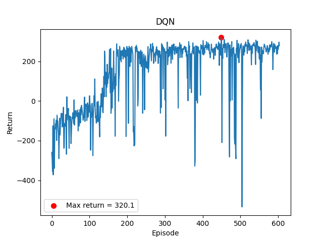
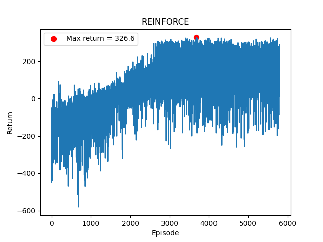
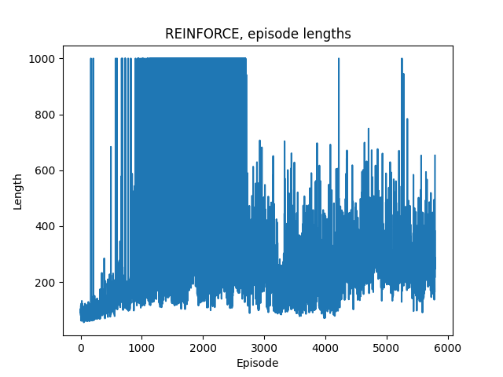
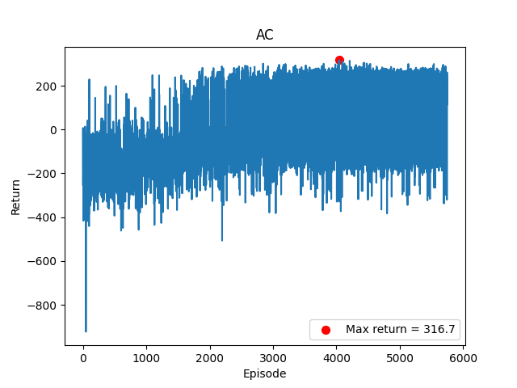
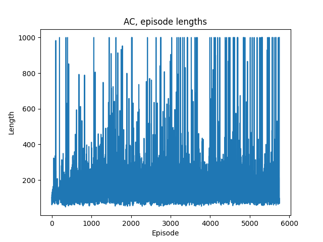
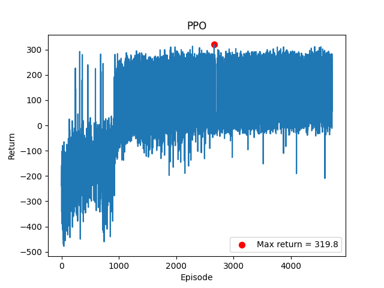

# Deep Reinforcement Learning

In this repo all code and results related to the special course 'Deep Reinforcement Learning' is published and described in the following sections. 

Algorithms implemented to run on "CartPole-v1" and "LunarLander-v2" with discrete action spaces: 
* Deep Q-learning (DQN)
* REINFORCE
* Actor-Critic (AC)
* Proximal Policy Optimization (PPO)

## Installation
For this project Python 3.8.10 was used. Please note that when using the [Gymnasium](https://gymnasium.farama.org) package it can be necessary to download and setup [Swig](https://www.swig.org/download.html). 

```bash
git clone
cd deep-rl
pip install -r requirements.txt
```

## Overview of code

`main.py`: This is the main file to run all experiments. There is a function 'run_main(env,method,hyperparameters)' where a certain method (DeepRL algorithm) is trained on a specific enviroment with a number of hyperparameters. 
* env: A string 'LunarLander-v2' or 'CartPole-v1'
* method: A string 'DQN', 'REINFORCE', 'AC' or 'PPO'
* hyperparameters: A dictonary with all parameters. An example could be:     
hyperparameters = {
        'num_frames': 500000,
        'num_epochs': 4,
        'batch_size': 32,
        'num_hidden': [128,64],
        'gamma': 0.99,
        'alpha': 1e-3,
        'lambda': 0.9,
        'beta': 0.01,
        'max_norm': 1.0,
        'var_eps': 0.1,
        'buffer_size': 20000,
        'eps': 1.0,
        'eps_end': 0.001,
        'eps_decay': 0.01,
        'eps_decay_rate': None,
        'max_frames_per_episode': 1000
    }
* train_agent: boolean indicating whether to train the agent (True) or load pretrained agent (False)

The agent get initialized with 'get_agent(...)' from utils and then the agent can either be trained or evaluated. If 'train_agent' = True, the function calls 'train' from 'train.py' which returns the results from the training. 

`train.py`: This is the main training loop for all agents, where the agent interact with the enviroment and gets updated. Note that the agents will be updated at different times e.g. REINFORCE after each episode, DQN after each frame. 

`eval.py`: If the goal is to see how the agent performs across 10 episodes run `eval.py` and select the 'method' variable to be 'DQN', 'REINFORCE', 'AC' or 'PPO' and select the enviroment. 


### experiments
All results are plotted and saved in the 'experiments' folder alongside the network parameters and the hyperparameters are saved in json files. There are 3 main plots: return per episode, episode lengths and avg. reward per 10000 frame. 

### utils
Helper functions for the replay buffer, plotting and saving results to 'experiments', initializing the agents, and illustrating agent performance by rendering the enviroment in 'human' mode.

### agents
The base model that DQN and REINFORCE inherits from in `DQN_agent.py` and `REINFORCE_agent.py` respectively are in `model.py` that initializes a neural network with two hidden layers, an Adam optimizer, learning rate scheduler and criterion. It also has a standard forward function, that are overwritten for some methods. For AC and PPO the 'AC' object in `AC_agent.py` is the base network with both an Actor Network and a Critic Network, both with two hidden layers. PPO is an extension / modification to AC. All agents are trained using the 'update' function in the agent classes.

## Results on LunarLander-v2

### DQN
Selected hyperparameters: "num_frames": 200000, "num_epochs": 4, "batch_size": 32, num_hidden": [128, 64], "alpha": 0.0001, "buffer_size": 20000, "eps": 1.0, "eps_end": 0.001, "eps_decay": 0.01

#### Returns per episode



#### Episode lengths


#### Avg reward per 10000 frame 


### REINFORCE
Selected hyperparameters: "num_frames": 2000000, "num_hidden": [128, 64], "gamma": 0.99, "alpha": 0.0003, "beta": 0.01, "max_norm": 1.0

#### Returns per episode



#### Episode lengths



#### Avg reward per 10000 frame 


### AC
Selected hyperparameters: "num_frames": 1000000, "num_epochs": 4, "batch_size": 32, "num_hidden": [128, 64], "gamma": 0.99, "alpha": 0.0003, "lambda": 0.95, "beta": 0.01, "max_norm": 1.0

#### Returns per episode



#### Episode lengths



#### Avg reward per 10000 frame 


### PPO 
Selected hyperparameters: "num_frames": 1000000, "num_epochs": 4, "batch_size": 16, "horizon": 64, "num_hidden": [128, 64], "gamma": 0.99, "alpha": 0.0003, "lambda": 0.95, "beta": 0.01, "max_norm": 1.0, "var_eps": 0.1

#### Returns per episode



#### Episode lengths


#### Avg reward per 10000 frame 


